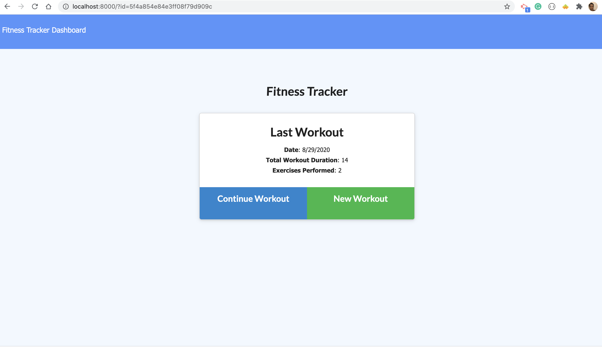
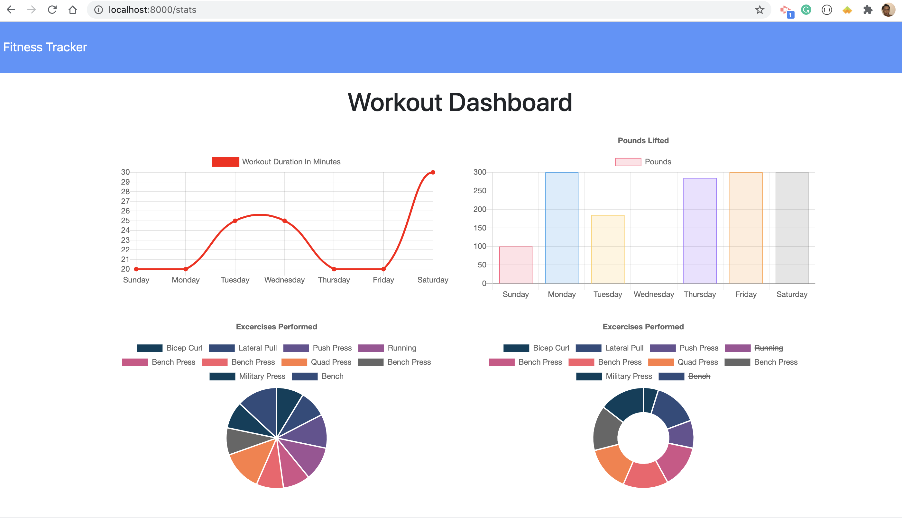

#  Project Title: WorkoutTracker-

## Badges: 
   
 

## User Story 

* As a user, I want to be able to view, create and track daily workouts. I want to be able to log multiple exercises in a workout on a given day. 

## Technology

- MongoDB
- mongoose
- Nodejs
- Express
- JavaScript

## Description: 

* Create a Mongo database with a Mongoose schema and handle routes with Express to create a fitness tracker applictaion. When the user loads the page, they should be given the option to create a new workout, or continue with their last workout.

* The app should be able to:

    - Add exercises to a previous workout plan
    - Add new exercises to a new workout plan
    - View multiple the combined weight of multiple exercises on the stats page
    - User should will be able to input the following 
        - Exercise name, type, weight, sets, reps, and duration of exercise. 
    - Add cardio or resistance exercise
    - Track distance traveled and 
    - Duration of exercise
  

## Table of Content: 

* [Installation](#installation)  
* [Usage](#usage)
* [License](#license)
* [Contributors](#contributors)
* [Tests](#tests)
* [Questions](#questions)
* [Link](#links)
* [Images](#images)

## Installaion:
* npm i
* npm run seed

## License: 
* MIT
# Contributing: 
* Pull request and stars are always welcome.
## Testing: 
* N/A

## Questions
If you have any questions, please contact at:   
Email: carolenesw@gmail.com

## link

* Repo link:
https://github.com/Carolenesw/WorkoutTracker-

* Deployed URL: 

## Images

